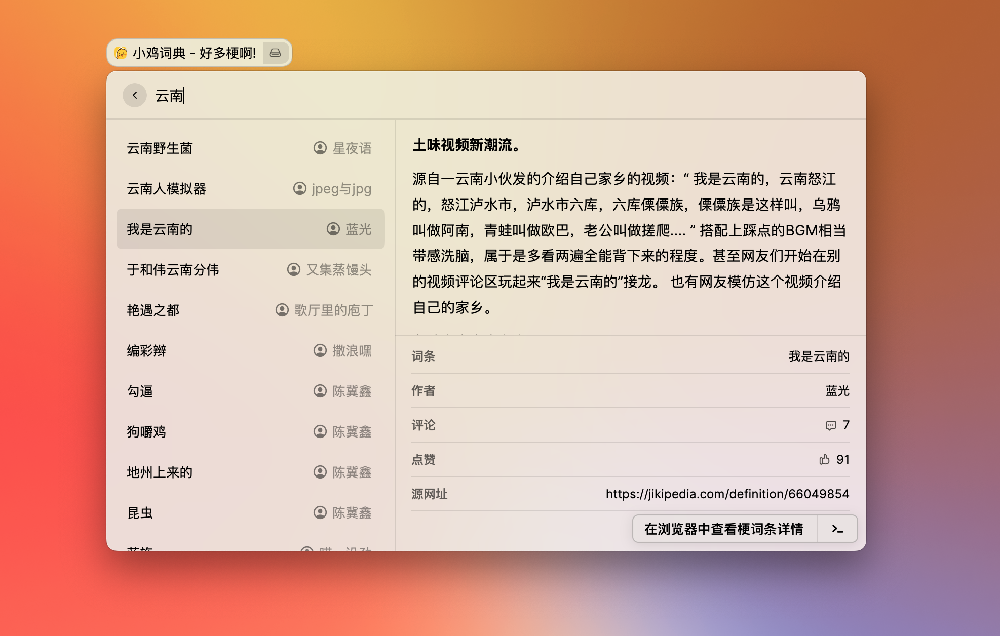

<br />

<p align="center">
  
</p>

<h1 align="center">
  Jikipedia for Raycast
</h1>

<p align="center">
  在 <a href="https://www.raycast.com">Raycast</a> 上利用 <a href="https://jikipedia.com/">Jikipedia</a> 搜索网络流行梗词条.
</p>
<p align="center" style="font-size: 14px;">
  Note: This extension only supports Chinese language
</p>


## 安装

1. 克隆该项目到本地任意位置.
2. 打开 `Raycast` 输入命令 `Import Extension`, 选择本地项目的根目录.
3. 执行:
    ```
    npm install
    npm run dev
    ```
4. 此时 “小鸡词典” 命令应该已经可以在 `Raycast` 内运行.

## 使用

通过命令 “小鸡词典” 可以进入扩展内, 使用关键词搜索你需要了解的梗词条, 或者直接回车获取随机梗词条.

|  |
| :------------------------------------------------------: |
|       查询结果页面效果演示<br>jikipedia-search-02        |


## 注意

1. 由于 `Raycast` 扩展和小鸡词典网站的限制, 内容的富文本只实现了粗体, 其余一些例如删除线, 下划线, 图片, 来源链接等均未实现, 请跳转网页获取更好的浏览体验.
2. 频繁请求会触发网站的爬虫验证机制, 遇到请求不到的时候请浏览器打开主页按操作解除限制即可.