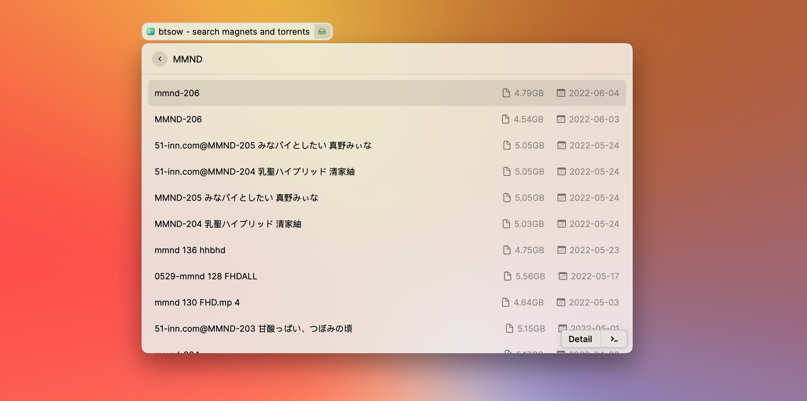
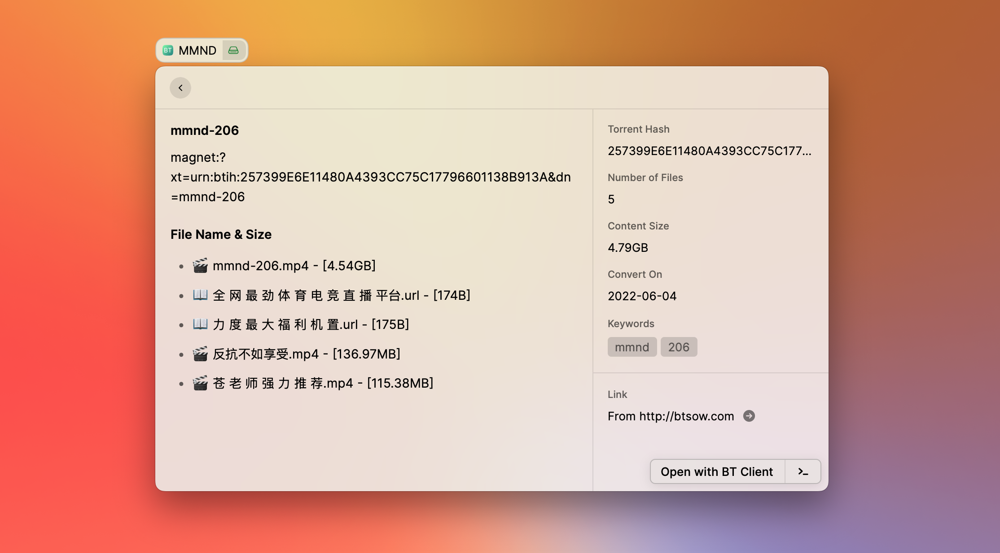

 
 

  

<h1 align="center">
  BTSOW for Raycast
</h1>

  在 <a href="https://www.raycast.com">Raycast</a> 上利用 <a href="https://btsow.com/">BTSOW</a> 搜索磁力链接.

 
 

## 安装

参照仓库 README.md

## 使用

通过命令 “BTSOW” 可以进入扩展内, 使用关键词搜索你需要磁力链接.

更多快捷键操作请自行安装扩展后自行查看.

|  |
| :----------------------------------------------: |
|     查询结果页面效果演示 btsow-search-02      |

## 注意

1. 由于网站的特殊性, 你可能需要通过手段使网络可以访问 BTSOW 的主站或者备用站, 扩展内提供了配置项供你填写访问网址.