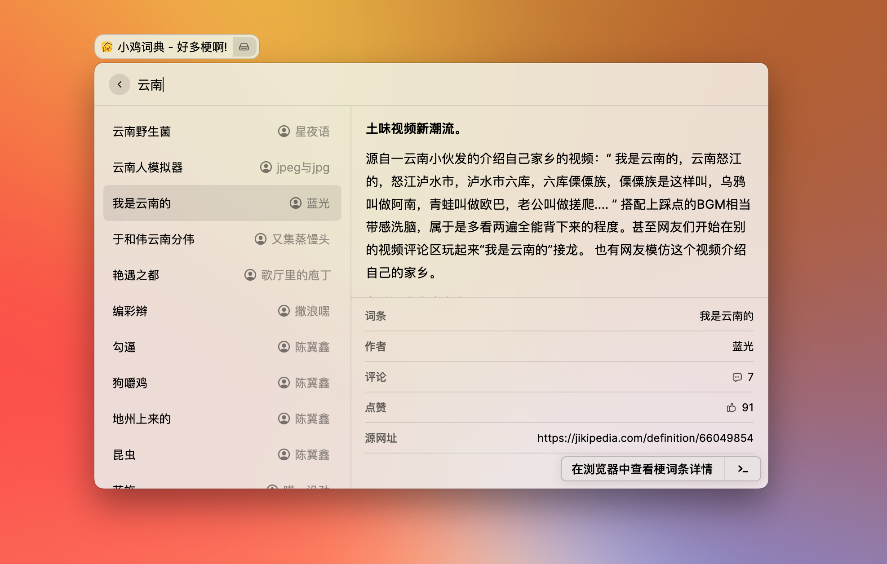

 
 

  

<h1 align="center">
  Jikipedia for Raycast
</h1>

  在 <a href="https://www.raycast.com">Raycast</a> 上利用 <a href="https://jikipedia.com/">Jikipedia</a> 搜索网络流行梗词条.

 
 

## 安装

参照仓库 README.md

## 使用

通过命令 “小鸡词典” 可以进入扩展内, 使用关键词搜索你需要了解的梗词条, 或者直接回车获取随机梗词条.

|  |
| :------------------------------------------------------: |
|       查询结果页面效果演示 jikipedia-search-02        |

## 注意

1. 由于 `Raycast` 扩展和小鸡词典网站的限制, 内容的富文本只实现了粗体, 其余一些例如删除线, 下划线, 图片, 来源链接等均未实现, 请跳转网页获取更好的浏览体验.
2. 频繁请求会触发网站的爬虫验证机制, 遇到请求不到的时候请浏览器打开主页按操作解除限制即可.